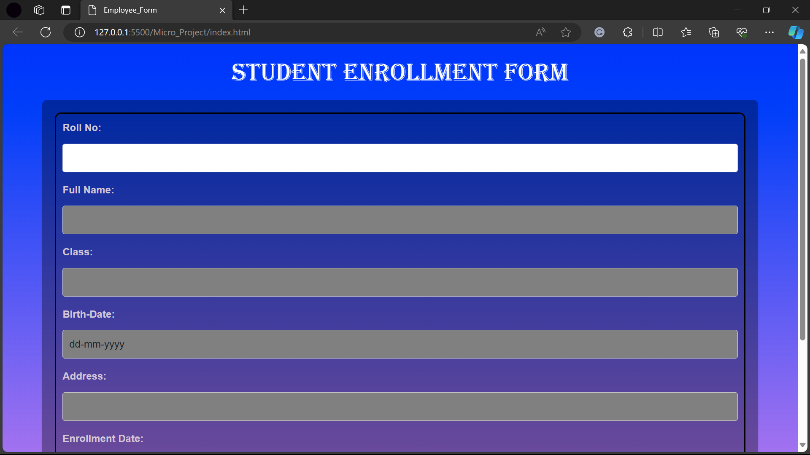

# Redmeefile for JsonPowerDB Project

## Table of Contents

1. [Title of the Project](#title-of-the-project)
2. [Description](#description)
3. [Benefits of using JsonPowerDB](#benefits-of-using-jsonpowerdb)
4. [Release History](#release-history)
5. [Illustrations](#illustrations)
6. [Scope of Functionalities](#scope-of-functionalities)
7. [Examples of Use](#examples-of-use)
8. [Project Status](#project-status)
9. [Sources](#sources)
10. [Other Information](#other-information)

## Title of the Project

**JsonPowerDB Student Enrollment System**

## Description

The JsonPowerDB Student Enrollment System is a web-based application designed for managing student information efficiently. It utilizes JsonPowerDB, a NoSQL, high-performance, and auto-archiving real-time database.

## Benefits of using JsonPowerDB

# Key Benefits of JsonPowerDB

1. **Proprietary High-Performance CRUD Algorithm:**
   - JsonPowerDB utilizes a proprietary algorithm for CRUD operations that is multiple times faster than popular DBMS, ensuring optimal performance.

2. **Serverless Support for Faster Development:**
   - Serverless support enables rapid development, allowing UI developers to create complete dynamic applications seamlessly.

3. **Embedded Web/Application Server and Caching:**
   - JsonPowerDB comes with a built-in web/application server and embedded caching, resulting in lightning-fast performance.

4. **Server-Side Native NoSQL with Best Query Performance:**
   - Being a server-side native NoSQL database, JsonPowerDB delivers superior query performance.

5. **Query on Multiple JPDB Databases:**
   - JsonPowerDB offers in-built support for querying on multiple JPDB databases, enhancing flexibility and scalability.

6. **Multi-Mode DBMS:**
   - JsonPowerDB supports multiple database modes, including Document DB, Key-Value DB, and RDBMS, catering to diverse application needs.

7. **Schema-Free Development and Maintenance:**
   - With a schema-free structure, JsonPowerDB facilitates easy development and maintenance of databases.

8. **Web-Services API for Language Agnostic Integration:**
   - JsonPowerDB's web-services API enables seamless integration with any programming language supporting HTTP.

9. **Pluggable API Framework:**
   - Enriched by a pluggable API framework, JsonPowerDB allows developers to create custom APIs that can be seamlessly plugged into any cloud JPDB instance.

10. **Standardized API Development Framework:**
    - The standardization of the API development framework ensures an easy, readable, and less error-prone development process.

11. **Multiple Security Layers:**
    - JsonPowerDB incorporates multiple security layers to safeguard data and ensure secure database operations.

12. **Nimble, Simple, In-Memory, Real-Time DBMS:**
    - JsonPowerDB is a nimble, simple-to-use, in-memory, and real-time database management system, providing optimal performance and responsiveness.

## Release History

- **Version 1.0.0** (December 15, 2023): Initial release of the JsonPowerDB Student Enrollment System.

    - Features:
      - Student information storage and retrieval.
      - CRUD operations for student records.
      - User-friendly form with validation.

## Illustrations

## Scope of Functionalities

The JsonPowerDB Student Enrollment System covers the following functionalities:

- **Student Information Management**: Efficient storage and retrieval of student data.

- **Form Validation**: Ensures data integrity by validating user inputs on the form.

- **CRUD Operations**: Supports Create, Read, Update, and Delete operations for student records.

## Examples of Use

1. **New Student Enrollment**:
   - Enter student details in the form.
   - Click the "Save" button to store the information in JsonPowerDB.

2. **Updating Student Information**:
   - Retrieve a student's data by entering their Roll No.
   - Update the required fields.
   - Click the "Update" button to save the changes.

## Project Status

The project is currently in its initial release, version 1.0.0. Further updates and enhancements are planned for future releases.

## Sources

- [JsonPowerDB Documentation](http://login2explore.com/jpdb/docs.html)

## Other Information

Feel free to contribute to the project by submitting issues or pull requests. For questions and support, please contact the project maintainers.

**Maintainer**: Shubham Kumar (shubham9905374230@gmail.com)
